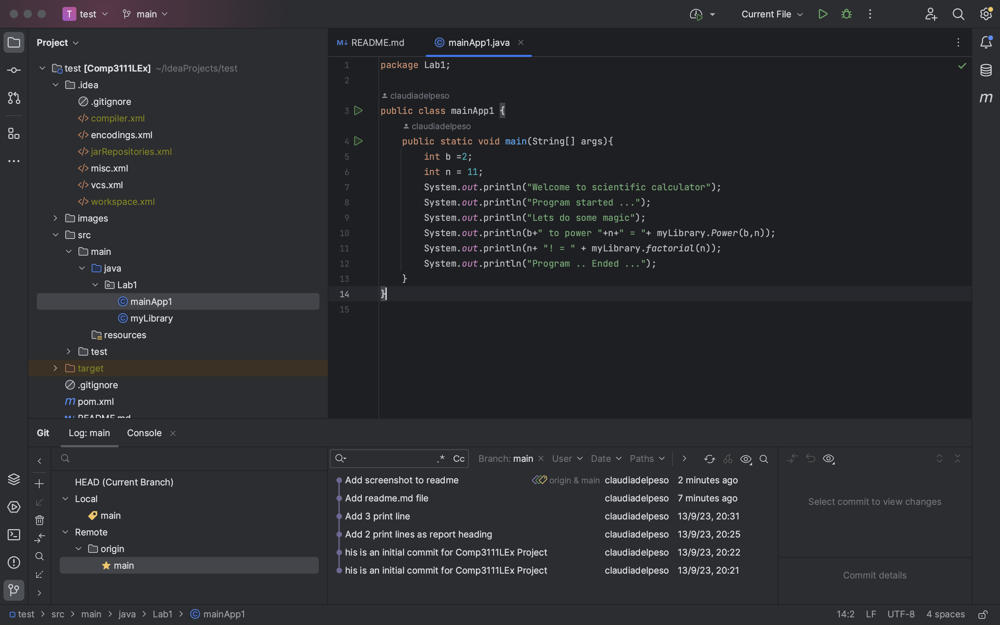

###  Lab 1 3111
This is the first lab of 3111. We learn how to set up environment and use git and github.

Its going to be fun!

In the following picture you can see how the intellij folder structure looks like

